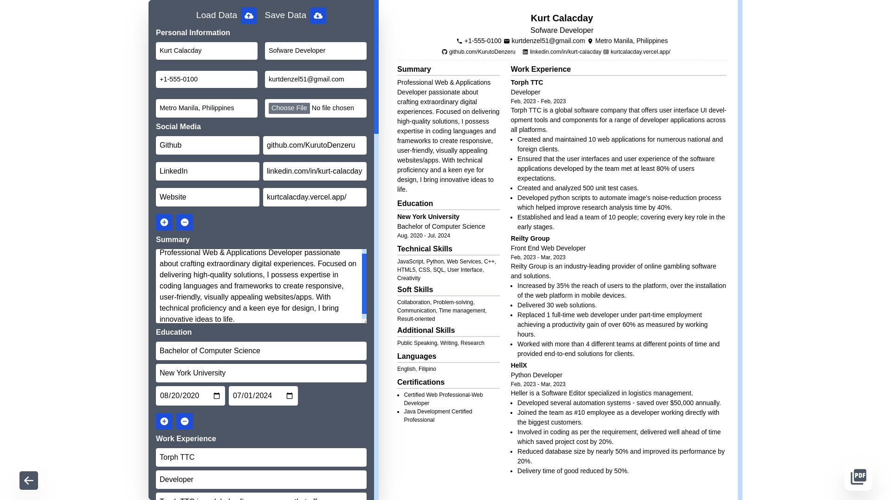

Robust client-side resume crafting solution utilizing React.js for efficient UI rendering, Tailwind's utility-first styling, and Canvas API integration for dynamic preview. Offers themeable design, responsive layouts, and cross-browser compatibility.
